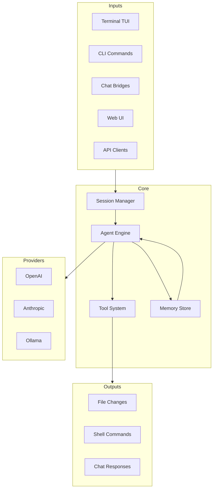

# Concepts

Understand the core concepts behind Savfox's architecture.

## Architecture Overview

## Key Concepts

<Card title="Sessions" href="/concepts/sessions" icon="layers">
  Conversation state and history management.
</Card>

<Card title="Context" href="/concepts/context" icon="file-text">
  How context is built and managed.
</Card>

<Card title="Memory" href="/concepts/memory" icon="database">
  Long-term memory and knowledge storage.
</Card>

<Card title="Tools" href="/concepts/tools" icon="wrench">
  Tool system and capabilities.
</Card>

<Card title="Approvals" href="/concepts/approvals" icon="check-circle">
  Approval workflows for safety.
</Card>

<Card title="Multi-Agent" href="/concepts/multi-agent" icon="users">
  Multi-agent routing and isolation.
</Card>

## Agent

The agent is the core AI assistant that:

- Processes your requests
- Uses tools to interact with your system
- Manages conversation context
- Makes decisions about actions

## Tools

Tools extend the agent's capabilities:

| Tool          | Description         |
| ------------- | ------------------- |
| File Read     | Read file contents  |
| File Write    | Create/modify files |
| Shell Execute | Run shell commands  |
| Search        | Search codebase     |
| Git           | Git operations      |
| Web Fetch     | Fetch web content   |

## Sandbox

The sandbox controls what the agent can do:

- **Read-only**: No file modifications
- **Workspace-write**: Modify files in workspace only
- **Full-access**: No restrictions

## Gateway

The gateway provides:

- HTTP/REST API
- WebSocket for real-time communication
- Chat bridge connections
- Remote access capabilities

## Configuration Layers

Configuration is resolved in order:

1. System defaults
2. User config (`~/.savfox/config.toml`)
3. Workspace config (`.savfox/config.toml`)
4. Profile overrides
5. CLI arguments
