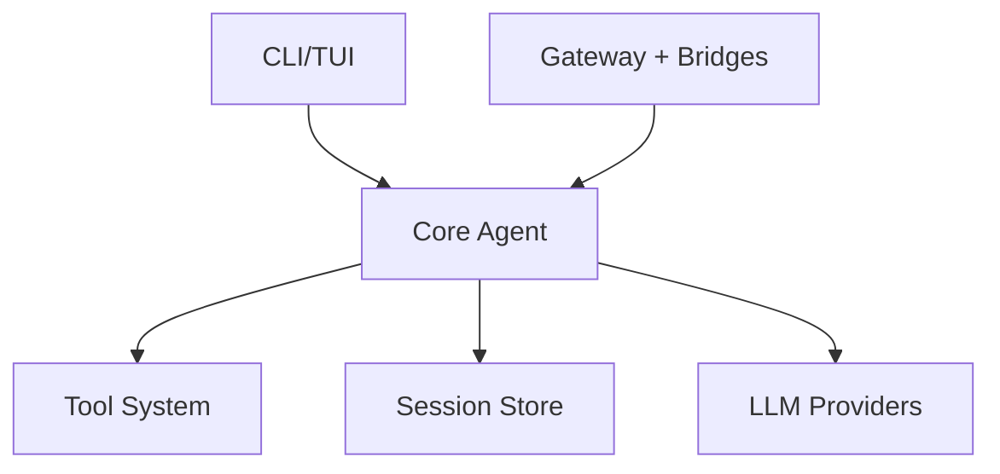

# Concepts

Understand the core concepts behind Savfox's architecture.

## Core Guides

<Card title="Configuration" href="/concepts/configuration" icon="settings">
  Layered config, profiles, environment variables, and overrides.
</Card>

<Card title="Sessions" href="/concepts/sessions" icon="layers">
  Session lifecycle, resume/fork behavior, and persistence.
</Card>

## Runtime Model

Savfox combines:

- Agent reasoning loop
- Tool calls (shell/file/search/patch)
- Approval workflow
- Sandbox policy enforcement
- Provider-specific model adapters

## Architecture Snapshot

