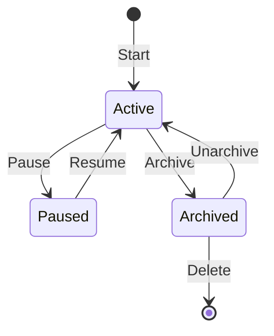

# Sessions

Sessions represent conversations with the AI agent. Each session maintains its own history, context, and state.

## Session Lifecycle



## Creating Sessions

Sessions are created automatically when you start a conversation:

```bash
# Interactive - creates new session
savfox

# Non-interactive - creates temporary session
savfox exec "Task"
```

## Resuming Sessions

Resume previous conversations:

```bash
# Interactive picker
savfox resume

# Resume most recent
savfox resume --last

# Resume by ID
savfox resume abc123
```

## Session Management

### List Sessions

```bash
savfox sessions list
```

### Archive Sessions

```bash
savfox sessions archive <id>
```

### Delete Sessions

```bash
savfox sessions delete <id>
```

## Forking Sessions

Create a branch from any point in a conversation:

```bash
# In TUI
/fork

# Or via gateway API
```

Forking is useful for:

- Exploring alternative solutions
- Testing different approaches
- Preserving context while trying new ideas

## Session Storage

Sessions are stored in:

```
~/.savfox/sessions/
├── abc123/
│   ├── history.json
│   ├── context.json
│   └── metadata.json
└── def456/
    └── ...
```

## Session Configuration

```toml
[sessions]
max_age_hours = 24
max_count = 100
auto_archive = true
```

## Per-Sender Sessions

When using chat bridges, you can isolate sessions per sender:

```toml
[gateway.routing]
per_sender_sessions = true
```

This ensures each user has their own conversation context.

## Session Context

Each session maintains:

- Conversation history
- File context
- Working directory
- Model preferences
- Active tools
