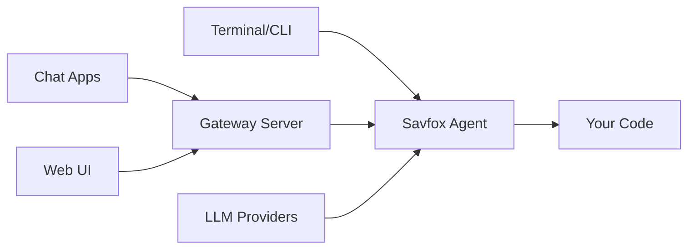

# Savfox

**AI-powered coding agent for the terminal with chat bridges, gateway server, and multi-platform support.**

Savfox connects to LLM providers (OpenAI, Anthropic, Ollama, LM Studio, and more) to help you write, review, and refactor code through an interactive TUI or non-interactive CLI.

## Key Features

| Feature                 | Description                                                                                                                 |
| ----------------------- | --------------------------------------------------------------------------------------------------------------------------- |
| **Interactive TUI**     | Chat with an AI agent in a rich terminal interface with markdown rendering, diff preview, and approval workflows            |
| **Non-interactive CLI** | Run one-shot tasks with `savfox exec`, pipe results, and integrate into scripts                                             |
| **Gateway Server**      | Remote HTTP/WebSocket access with OpenAI-compatible API, session management, and cron scheduling                            |
| **Chat Bridges**        | Connect to Discord, Telegram, Slack, Matrix, Mattermost, Google Chat, Line, Feishu, IRC, and Webhook                        |
| **Multi-layer Sandbox** | Platform-native sandboxing (macOS Seatbelt, Linux Landlock, Windows restricted token) plus configurable approval policies   |
| **MCP Support**         | Run as an MCP server for integration with Claude Desktop and other MCP clients, or connect to external MCP servers as tools |
| **Session Management**  | Resume, fork, and archive conversations across sessions                                                                     |

## How it Works



## Quick Start

### Install

```bash
git clone https://github.com/savfox-ai/savfox.git
cd savfox
cargo install --path crates/savfox-cli
```

### Login

```bash
savfox login
```

### Run

```bash
# Interactive mode
savfox

# Non-interactive
savfox exec "Add error handling to src/main.rs"

# With auto-approval
savfox --full-auto exec "Refactor the auth module"
```

## Documentation Sections

<Card title="Getting Started" href="/start/getting-started" icon="rocket">
  Installation, login, and your first session.
</Card>

<Card title="Installation" href="/install" icon="download">
  Docker, npm, and deployment options.
</Card>

<Card title="CLI Reference" href="/cli" icon="terminal">
  All commands, flags, and examples.
</Card>

<Card title="Gateway Server" href="/gateway" icon="server">
  Remote access, API, and chat bridges.
</Card>

<Card title="Channels" href="/channels" icon="message-square">
  Connect Discord, Telegram, Slack, and more.
</Card>

<Card title="Providers" href="/providers" icon="cpu">
  Configure OpenAI, Anthropic, Ollama, and other LLMs.
</Card>

<Card title="Configuration" href="/concepts/configuration" icon="settings">
  Config files, profiles, and feature flags.
</Card>

<Card title="Security" href="/security" icon="shield">
  Sandbox modes, tokens, and safety controls.
</Card>

## Learn More

<Card title="Concepts" href="/concepts" icon="lightbulb">
  Core concepts: sessions, context, memory, tools.
</Card>

<Card title="Automation" href="/automation" icon="zap">
  Hooks, cron jobs, and webhooks.
</Card>

<Card title="Web UI" href="/web" icon="monitor">
  Browser dashboard for chat and config.
</Card>

<Card title="MCP Server" href="/tools/mcp-server" icon="plug">
  MCP integration with Claude Desktop.
</Card>

## License

Apache License 2.0
