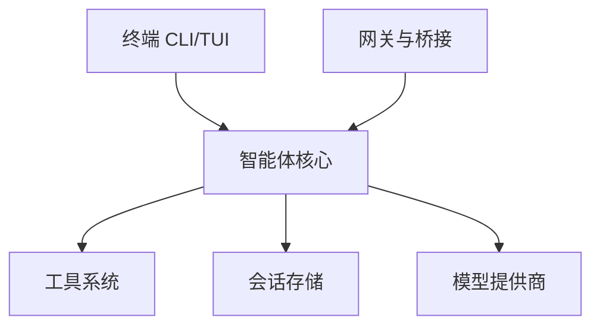

# 概念

掌握 Savfox 的核心工作机制：配置、会话、工具调用与网关协作。

<Card title="配置" href="/concepts/configuration" icon="settings">
  分层配置、环境变量与命令行覆盖。
</Card>

<Card title="会话" href="/concepts/sessions" icon="layers">
  会话生命周期、恢复与分叉。
</Card>

## 架构概览

