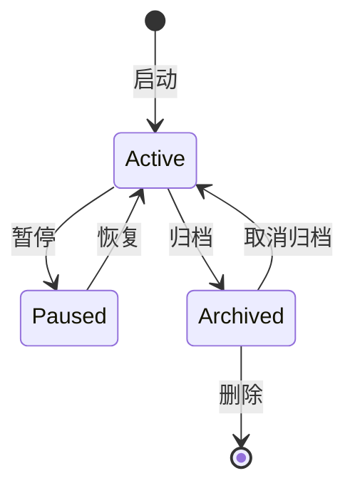

# 会话

会话代表与 AI 智能体的对话。每个会话维护独立的消息历史、上下文和状态。

## 会话生命周期



## 创建会话

启动对话时自动创建会话：

```bash
# 交互式 - 创建新会话
savfox

# 非交互式 - 创建临时会话
savfox exec "任务"
```

## 恢复会话

恢复之前的对话：

```bash
savfox resume              # 交互式会话选择器
savfox resume --last       # 恢复最近的会话
savfox resume <SESSION_ID> # 恢复指定会话
```

## 会话管理

### 列出会话

```bash
savfox sessions list
```

### 归档会话

```bash
savfox sessions archive <id>
```

### 删除会话

```bash
savfox sessions delete <id>
```

## 会话分叉

从对话中的任意点创建分支：

```bash
# 在 TUI 中
/fork

# 或通过命令行
savfox fork
```

分叉适用于：

- 在已有上下文上探索不同方案
- 测试不同的实现路径
- 保留上下文的同时尝试新想法

## 会话存储

会话持久化存储在：

```
~/.savfox/sessions/
├── abc123/
│   ├── history.json
│   ├── context.json
│   └── metadata.json
└── def456/
    └── ...
```

## 会话配置

```toml
[sessions]
max_age_hours = 24
max_count = 100
auto_archive = true
```

## 按发送者隔离会话

使用聊天桥接时，可以按发送者隔离会话：

```toml
[gateway.routing]
per_sender_sessions = true
```

这确保每个用户拥有独立的对话上下文。

## 会话上下文

每个会话维护：

- 对话历史
- 文件上下文
- 工作目录
- 模型偏好
- 活跃工具
