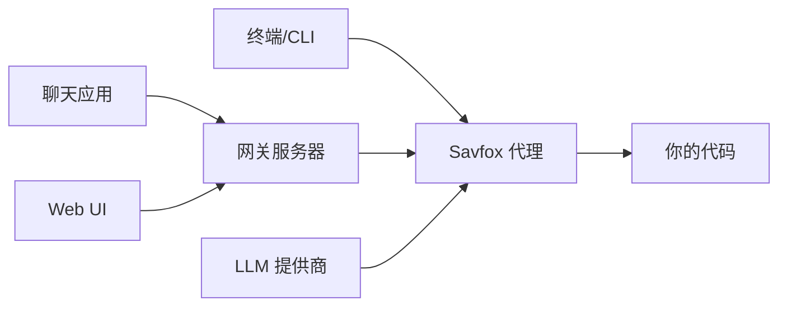

# Savfox

**AI 驱动的终端编程助手，支持聊天桥接、网关服务器和多平台。**

Savfox 连接多种 LLM 提供商（OpenAI、Anthropic、Ollama、LM Studio 等），通过交互式 TUI 或非交互式 CLI 帮助你编写、审查和重构代码。

## 核心功能

| 功能             | 描述                                                                                       |
| ---------------- | ------------------------------------------------------------------------------------------ |
| **交互式 TUI**   | 在丰富的终端界面中与 AI 代理聊天，支持 Markdown 渲染、差异预览和审批工作流                 |
| **非交互式 CLI** | 使用 `savfox exec` 运行一次性任务，管道输出，集成到脚本中                                  |
| **网关服务器**   | 远程 HTTP/WebSocket 访问，支持 OpenAI 兼容 API、会话管理和定时任务                         |
| **聊天桥接**     | 连接 Discord、Telegram、Slack、Matrix、Mattermost、Google Chat、Line、飞书、IRC 和 Webhook |
| **多层沙箱**     | 平台原生沙箱（macOS Seatbelt、Linux Landlock、Windows 受限令牌）加上可配置的审批策略       |
| **MCP 支持**     | 作为 MCP 服务器与 Claude Desktop 集成，或连接外部 MCP 服务器作为工具                       |
| **会话管理**     | 恢复、分支和归档对话                                                                       |

## 工作原理



## 快速开始

### 安装

```bash
git clone https://github.com/savfox-ai/savfox.git
cd savfox
cargo install --path crates/savfox-cli
```

### 登录

```bash
savfox login
```

### 运行

```bash
# 交互模式
savfox

# 非交互模式
savfox exec "为 src/main.rs 添加错误处理"

# 自动审批模式
savfox --full-auto exec "重构认证模块"
```

## 文档章节

<Card title="快速开始" href="/start/getting-started" icon="rocket">
  安装、登录和首次会话。
</Card>

<Card title="安装" href="/install" icon="download">
  Docker、npm 和部署选项。
</Card>

<Card title="CLI 参考" href="/cli" icon="terminal">
  所有命令、选项和示例。
</Card>

<Card title="网关服务器" href="/gateway" icon="server">
  远程访问、API 和聊天桥接。
</Card>

<Card title="频道" href="/channels" icon="message-square">
  连接 Discord、Telegram、Slack 等。
</Card>

<Card title="提供商" href="/providers" icon="cpu">
  配置 OpenAI、Anthropic、Ollama 等 LLM。
</Card>

<Card title="配置" href="/concepts/configuration" icon="settings">
  配置文件、档案和功能标志。
</Card>

<Card title="安全" href="/security" icon="shield">
  沙箱模式、令牌和安全控制。
</Card>

## 了解更多

<Card title="概念" href="/concepts" icon="lightbulb">
  核心概念：会话、上下文、记忆、工具。
</Card>

<Card title="自动化" href="/automation" icon="zap">
  钩子、定时任务和 Webhook。
</Card>

<Card title="Web UI" href="/web" icon="monitor">
  用于聊天和配置的浏览器仪表板。
</Card>

<Card title="MCP 服务器" href="/tools/mcp-server" icon="plug">
  与 Claude Desktop 的 MCP 集成。
</Card>

## 许可证

Apache License 2.0
